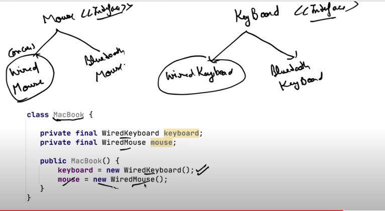
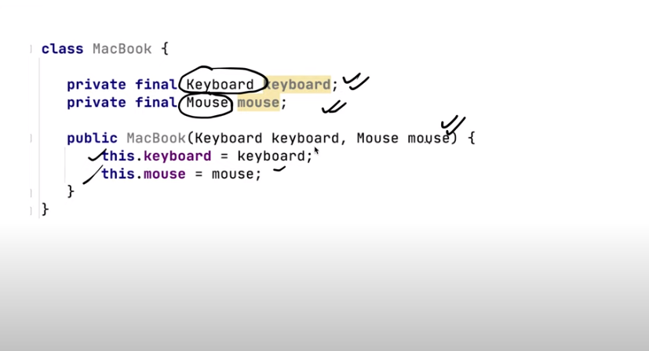

# Solid Principles

## S - Single Responsibility Principle
Classes shoul have a single responsibility meaning it will have only one point of change 
Example : I have a item Class with all the properties of it and then I have an Invoice class which performs multiple actions like changeThePrice, Save the itemToDB and printInvoice
so I have 3 reasons to change  the class like in insted of saving to db i want to change to files or if i want to change the printing logic of if I want to update priceCalculation logic 
but according to S principle I shoul have only one reason to change the class 

So here I will split the 3 functionality into 3 classes each have only a sigle responsibility, like eithet printTheInvoice or Save to B or compute The Cost

## O - Open/Closed Principle

Opne closed principle says that a class should be open to extention and close to modification 
Example : if i have a class to saveFile to db , now that class is tested and already Live, now i need to save data in files then if i modify the already tested class then i need to make cahnges in tested and live class, Insted waht I should do is the create an interface lets say InvoiceDAO and then I will extend diffrent classes like SaveToDB and SaveTOFiles in stead of changing the already tested and live code

## Liskov substitution Principle 
### If class B is subtype of class A then class b obkject can be substituted by class A object without breaking the flow of the program 
Example : Lets say I have a Vehicle class and I have 2 methods startEngine and Accelerate and then my client code create object of differenct vehicle like moterCycle , Car , Bike then both the method will work perfrctly ofr the car and bike but when i use it for vehicle - bycycle I need to throgh extenction for start engine method, because bycle has no engine,

### So to follwo the Liskov substitutuion principle subclass should always extend the feature of super class but not contract the feature,
#### Solutiuon to the above problem is the I create an interface Vehicle then 2 classes engineVehicle and noEngine Vehicle then i will extend engine Vehicle for car adn other engine vehicle and noEngine class for bycycle, now when the client code try to create the objects of differenct class insted of getting runtime error(lets say we are printing the result by using toString method and then if bycycle was throwing erro null.toString will throw nullPointer Exception ) it will give compile time error when we use startEngine method in bycycle class 

So we changed the design according to Liskov principle and now our code is more robust 

## Interface seggerigation prinicple 
### Clent needs to only implement the functionality which is needed 
#### Example for this we need to split the interface itself to devide the functionality 

## Dependency Inversion principle 

### Classese should depend on interface rather than concrete classes 

### Wrong Design : I am creating instance of classes which will give difficulty if there is any update  


### Right Design : Now I can modify easilty and can pass any type of keyBoard and Mouse insted of perticular one in the client code


## Example which adhre dependency inversion : 

```
// Mouse interface
interface Mouse {
    void click();
    void move(int x, int y);
    // Other mouse-related methods
}

// Keyboard interface
interface Keyboard {
    void type(String keys);
    // Other keyboard-related methods
}

// MacBook class depends on Mouse and Keyboard abstractions through constructor injection
class MacBook {
    private final Mouse mouse;
    private final Keyboard keyboard;

    // Constructor with dependencies injected
    public MacBook(Mouse mouse, Keyboard keyboard) {
        this.mouse = mouse;
        this.keyboard = keyboard;
    }

    // Other MacBook-specific methods or functionalities
    public void performActions() {
        mouse.click();
        mouse.move(100, 200);
        keyboard.type("Hello, MacBook!");
    }
}

// Concrete implementation of a specific Mouse
class SpecificMouse implements Mouse {
    @Override
    public void click() {
        // Implementation of click() method for SpecificMouse
        System.out.println("SpecificMouse clicked");
    }

    @Override
    public void move(int x, int y) {
        // Implementation of move() method for SpecificMouse
        System.out.println("SpecificMouse moved to (" + x + ", " + y + ")");
    }
    // Other specific mouse-related methods
}

// Concrete implementation of a specific Keyboard
class SpecificKeyboard implements Keyboard {
    @Override
    public void type(String keys) {
        // Implementation of type() method for SpecificKeyboard
        System.out.println("Typed with SpecificKeyboard: " + keys);
    }
    // Other specific keyboard-related methods
}

public class Main {
    public static void main(String[] args) {
        // Create instances of specific implementations
        Mouse specificMouse = new SpecificMouse();
        Keyboard specificKeyboard = new SpecificKeyboard();

        // Create MacBook instance injecting specific implementations
        MacBook myMacBook = new MacBook(specificMouse, specificKeyboard);

        // Use MacBook to perform actions
        myMacBook.performActions();
    }
}


```

## Note : I am passing the concrete clsses like specificMouse and specificKeyboard here which implemets MOuse and Keyboard interfaces respecively , because I can only create object of concrete calsses that implements the interfaces my constructor looks like 

```
   // Constructor with dependencies injected
    public MacBook(Mouse mouse, Keyboard keyboard) {
        this.mouse = mouse;
        this.keyboard = keyboard;
    }
```

here the Mouse and KeyBoard are interfaces so I will pass the object of concrete clsees who implements these interfaces hence now my Macbook calss is dependent on abstraction instead of the concrete clasees 


