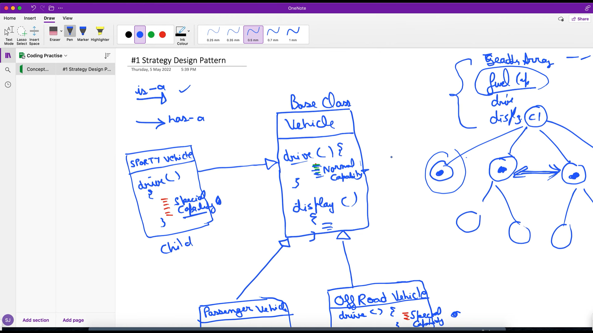
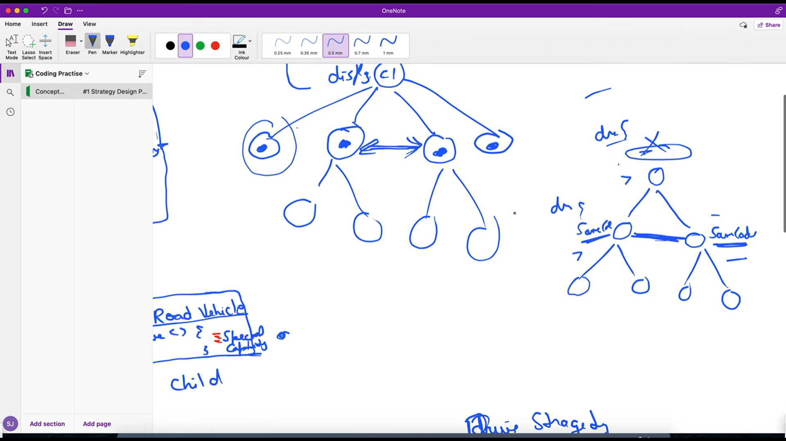

# Strategy Design Pattern
Lyman expalnation : When we some functionality in base class which is not used by child classes and multiple classes are implementing thier own specialized method which is common in them slef but because iti is not avaialble in the parent class they are duplicating the code 

## to solve this problem we used Starategy pattern where we created a diffrent Interface where we just declared all the posible capabilities.methods now insted of assign ning a specific class object to the proerty of higher level class we are just decalsreinf the interface propertey and by using the constructor injection we are allowing to pass lower level calsses which capabilitiew they wanted to use .

### It is similar to what we have done in dependency inversion example of Mackbook , keyboard and Mouse 

Applying the Strategy Design Pattern

The video demonstrates the use of the Strategy design pattern to handle different types of drives (normal and special) in the vehicle design system.
An IDriverStrategy interface is introduced to define the common contract for different drive strategies.
Concrete implementations of the IDriverStrategy interface are created for normal and special drive types.
The Vehicle class is then composed with the appropriate IDriverStrategy implementation, allowing it to use the desired drive behavior.
Handling Duplication and Delegation

As the system grows, with more child classes inheriting from the base class, the potential for code duplication increases.
The video discusses how the Strategy pattern can help address this issue by allowing each child class to have its own unique drive strategy implementation, rather than duplicating code in the base class.
Delegation is introduced as a technique to handle situations where child classes have different drive capability requirements than the parent class.
Java Code Implementation

The video provides a step-by-step Java code implementation of the Strategy design pattern to address the challenges in the vehicle design system.
The key steps include:
Creating the IDriverStrategy interface to define the common contract for drive strategies.
Implementing concrete NormalDriverStrategy and SpecialDriverStrategy classes that implement the IDriverStrategy interface.
Composing the Vehicle class with the appropriate IDriverStrategy implementation, allowing it to use the desired drive behavior.
Demonstrating how the Strategy pattern helps avoid code duplication and handle delegation when child classes have different drive capability requirements.
Overall, the video emphasizes the importance of design patterns, particularly the Strategy pattern, in managing complexity and maintaining flexibility in software design. The Java code implementation showcases how the Strategy pattern can be effectively applied to address the challenges in the vehicle design system.

