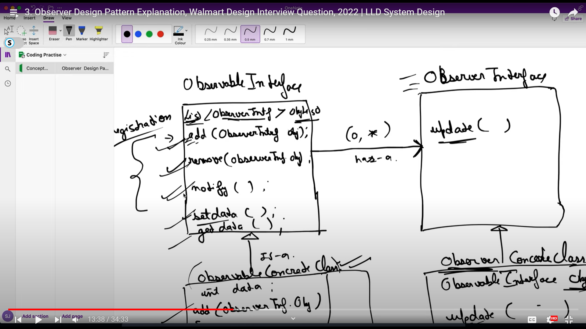
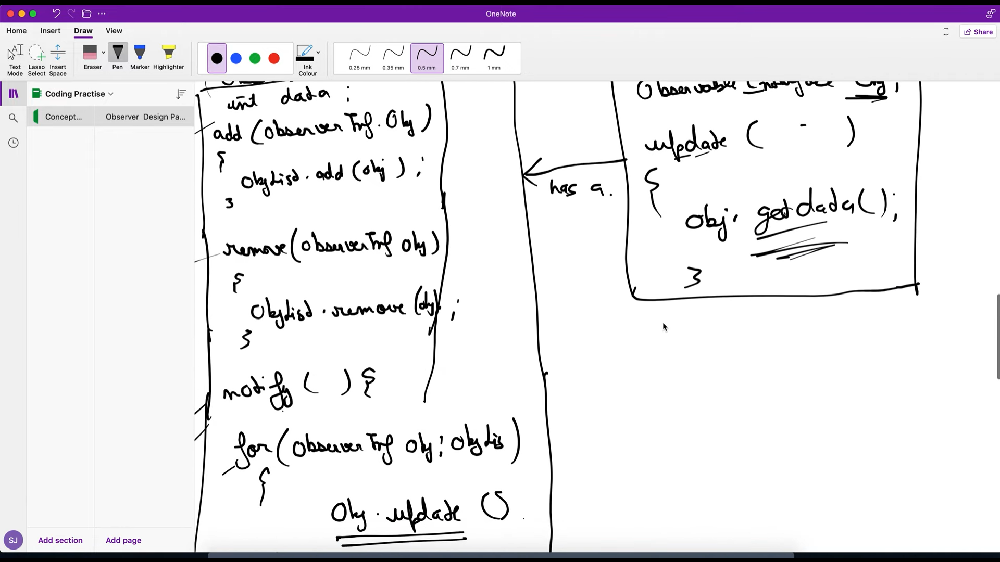

We make 2 interface Observalbe and Observer

Observer Pattern Summary
Key Takeaways:

The Observer Pattern is a design pattern where an object (the subject) maintains a list of its dependents (observers) and notifies them automatically of any state changes, usually by calling one of their methods.

The pattern consists of two main components:

Observable/Subject: The object that holds the state and notifies its observers when the state changes.
Observer: The objects that want to be notified of the subject's state changes.
When the state of the Observable changes, it notifies all its registered Observers by calling their update() method. This allows the Observers to react to the changes.

The Observable maintains a list of its Observers and provides methods to add, remove, and notify them.

The Observers register themselves with the Observable to receive updates. They implement the update() method to handle the notifications from the Observable.

This pattern promotes loose coupling between the Subject and its Observers, allowing the Subject to be reused without tight dependencies on the Observers.

The example implementation demonstrates how to use the Observer Pattern to create a notification system for out-of-stock products. The Available interface represents the Observable, and the Notification interface represents the Observer.

The Available interface has methods to add, remove, and notify Observers. The Notification interface has methods to handle the notifications from the Observable.

The concrete implementation shows how to use these interfaces to create a system that notifies customers when a previously out-of-stock product becomes available again.

The pattern can be further extended to handle more complex scenarios, such as multiple Observers with different notification preferences or more advanced business logic.

