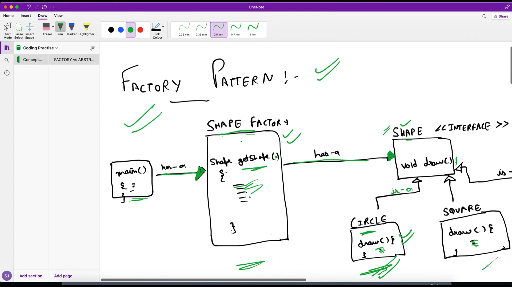
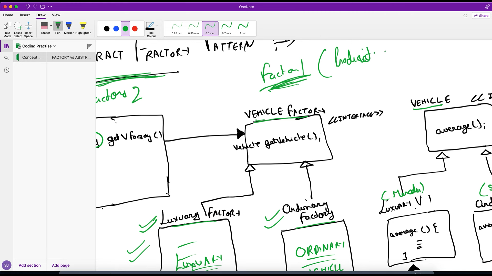

Whenever we create object and there is condition based on it we create object, It is heavily used in company 

In factory pattern we create a factory and an inteface ex shape and diffent classes like circle, rectangle , and square will implement , factroy will be source of truth and bases on the input it will retrun the object

Abstract fractory pattern is Factory of Factory 

