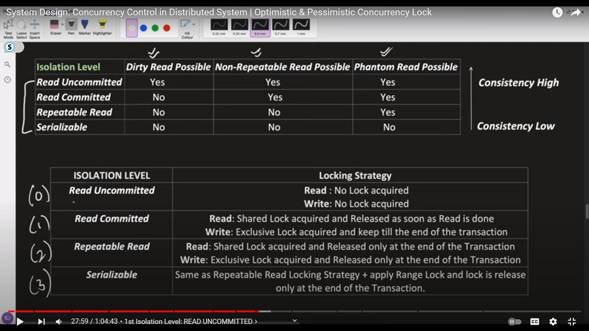

# Concurrency Control In Distributed Systems

#### Summary : Lets say if the code block is bieng accesss my multiple threads then there will be inconsistancy becase same piece of code can change the state.
Simple solution : Uses syncronized block which will take care of accessing the code by multiple threads
But this wont work for distributed systems
1 process can have multiple threads
and in DS there can be multiple process accessing the code.

to solve this problem we need to undersaten the OPTIMISTIC CONCURRENCY CONTROL  and PASIMISTIC CONCURRENCY CONTROL

both the concurrency control can be understood bases on the level of Isolation we need, which are
to understand isolation we need to understand som common term like

#### Dirty Read problem- where 2 threads are reading the same data but get diffrent result because it is bieng writter by some thread and we didnt put any lock on it and it is not yet commited.
#### Non repeatable Read Problem : 
#### Phantom Read Problem : 

### what is DB lock and commit ?
 for this we need to undersatnd the there are 2 types of locks 
#### 1. Sharable Locking : can be shared by multiple threads but only one can write rest can only read 
#### 2. Exclusive Lock : no other thread can read or write

 #### Commit : it comes from transactions 

Transaction : trasaction are nothing but it starts if perform s certain task and it check the both the tasks are sucessfull of not 
if the are successfull then it will commit and then End the transaction other wiese if any of them fail it will Roolback 

Example :  sending money from one bank to another

There are diffrent approaches to achieve concurency and level of concurrenty you need to achieve , look table below : 

 
