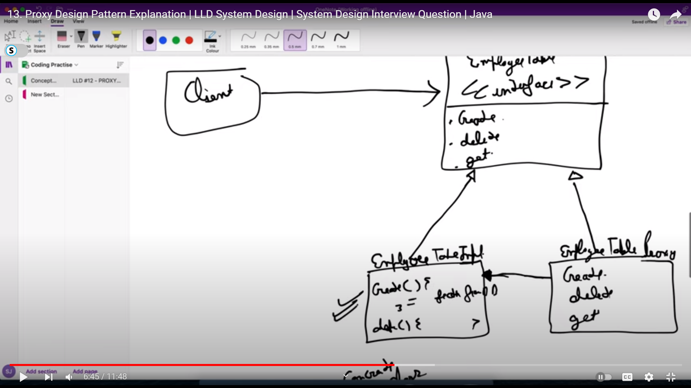

# Proxy Design Pattern

### Example : Authentication, Caching , pre Processsing and Post Processing  

We can have multipe proxy handlers beteeen the client and server 

we can use it for logging, event handles , sometimew we need to publish event if anything is changed, centralized logging 

## Note : Spring boot also create proxy of the bean when we create a bean

so as shown in example the request instead of going directly to the concrete calss it will first go to the proxy it will validate it and then pass it to the the concreate class so this way if we need to do anything like logging and pre processing we can do it in the proxy class

