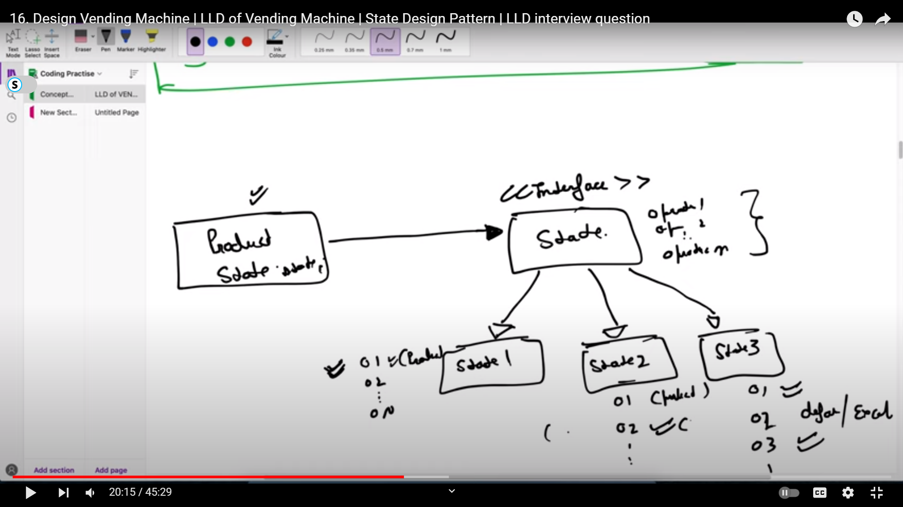
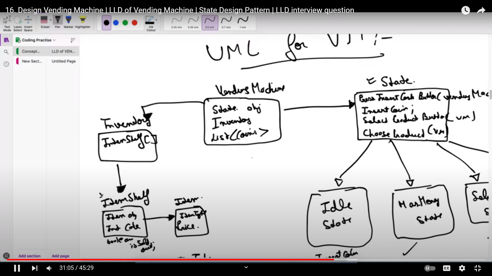
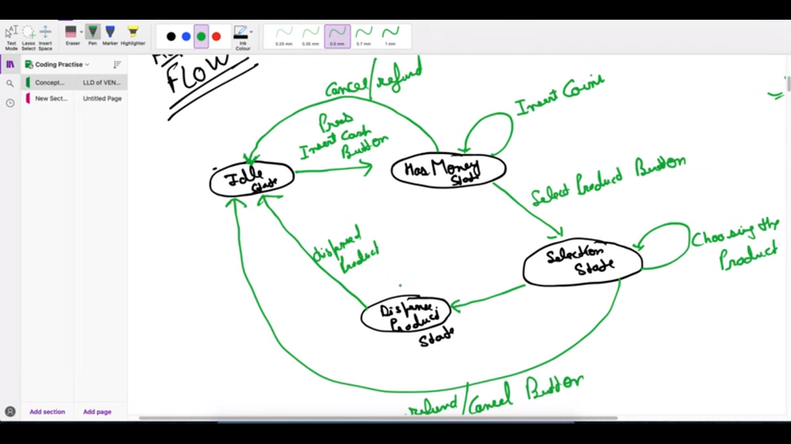

# State Design Pattern

## we used state design pattern to solve the vending machine design , we can also use COR but if its like we need to check layer by layer 

We simple create an interface with all the required fnctionality and then we create seperate concrete calss for each of the state and only implement the required functionality 

