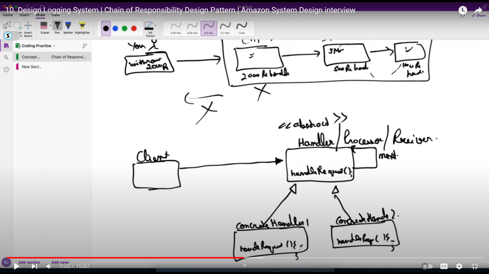

# Chain of responsibility Pattern

## Examples 1. ATM , 2 Vending Maching 3. Logger 

Lest take an example of ATM machine 

Driver - > Take 200 Cash Out  ---> Different handlers like 100 Rs handler , 2000 Rs Handlers , 500 Note handler (the request will start from a handlers Each handler will have the the link to previos handleer )

Hamdler | linkToNextHandler --> Handler | linkk to next Handler ......

So at each handle the handler wil check that can it process the request if yes then process if not the pass to next handler 

like 2000R request came from dricer code , it will pass to 2000Rs NOte handle and check if it can complete, other iwrse pass to 500 rs Handler and so on so forth

